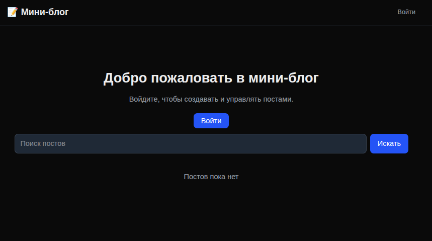
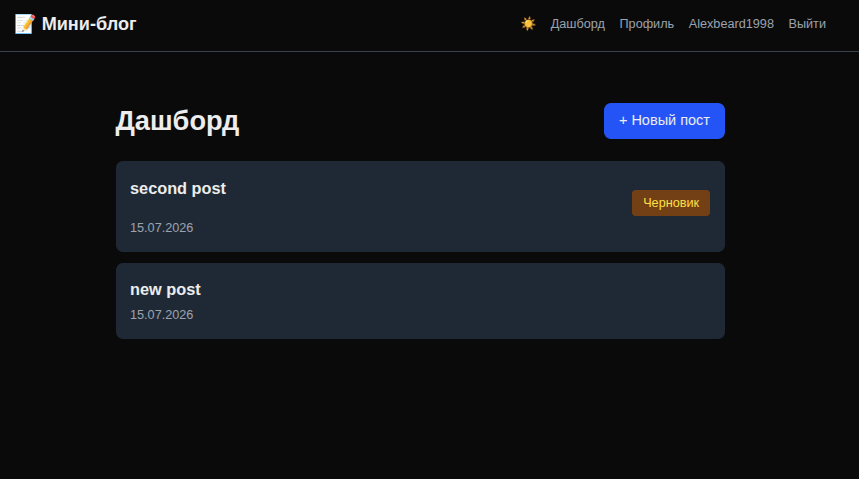

# Mini Blog

🔗 [Живое демо](https://mini-blog-alexbeard.vercel.app)

Полноценная блог-платформа на Next.js 16 с авторизацией, загрузкой изображений и продвинутым UX.





## 🔥 Возможности

- **Авторизация** — вход по Email/паролю и через GitHub OAuth
- **Профиль** — установка и смена пароля
- **Защита роутов** — middleware для неавторизованных
- **Посты** — создание, редактирование, удаление, черновики
- **Загрузка изображений** — обложки для постов
- **Темы** — переключение светлой/тёмной темы (cookies)
- **Поиск и пагинация** — серверная фильтрация и разбивка на страницы
- **Streaming** — Suspense для мгновенной загрузки
- **Адаптивный дизайн** — Tailwind CSS

## 🛠️ Стек

- Next.js 16 (App Router)
- TypeScript
- Auth.js (NextAuth v5)
- Prisma ORM + PostgreSQL
- Tailwind CSS
- React 19 (useOptimistic, useTransition)

## 🚀 Запуск

```bash
git clone https://github.com/Alexbeard1998/mini-blog.git
cd mini-blog
npm install
```

Создай `.env`:

```
DATABASE_URL="postgresql://..."
AUTH_SECRET="секретный_ключ"
AUTH_GITHUB_ID="..."
AUTH_GITHUB_SECRET="..."
```

```bash
npx prisma migrate dev
npm run dev
```